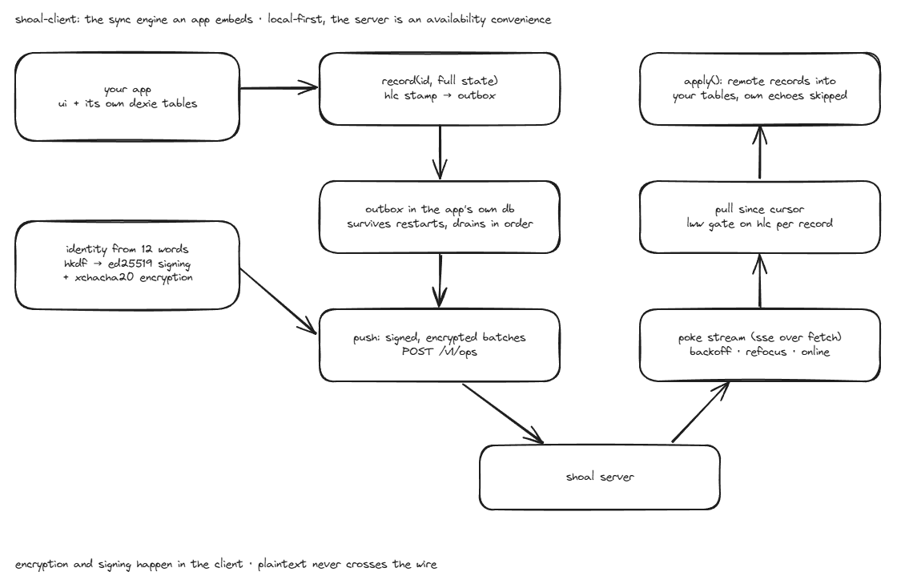

# shoal-client

TypeScript client for [shoal](https://github.com/emerson-d-lopes/shoal),
the self-hosted end-to-end-encrypted sync server for local-first apps.
Wire-compatible with the Kotlin client and the Rust server: the test
suite pins the exact identity derivation all clients share.

Crypto is [noble/scure](https://paulmillr.com/noble/): BIP39 phrase to an
ed25519 request-signing key and an XChaCha20-Poly1305 payload key. The
server only ever sees ciphertext.



## Install

```sh
pnpm add github:emerson-d-lopes/shoal-client
```

## Use

```ts
import { ShoalSync, SyncKeys } from "shoal-client";
import { DexieShoalStorage } from "shoal-client/dexie";

// In your Dexie schema's next version:
//   _shoal_outbox: "opId, createdAt",
//   _shoal_meta: "recordId",
//   _shoal_kv: "key",

const sync = new ShoalSync({
  serverUrl: "https://your-shoal.example",
  mnemonic: SyncKeys.generateMnemonic(), // show it to the user once
  collection: "myapp",
  nodeId: crypto.getRandomValues(new Uint32Array(1))[0], // persist this
  storage: new DexieShoalStorage(db, "myapp"),
  apply: async (recordId, body) => {
    // Route on recordId prefix and write to your tables. Called only when
    // the incoming op wins LWW; never called for your own echoed ops.
  },
});

// After every local write: full record state, keyed by a stable record id.
await sync.record(`habit/${habit.id}`, habit);

// Live: initial sync, then a sync on every server poke, reconnecting with
// backoff. Also retries when the browser comes back online or the tab is
// refocused.
sync.start();
// ...
sync.stop();

// Or drive it yourself, if you would rather not hold a connection open.
await sync.sync(); // push outbox, pull + merge

// Restore on a new device = same mnemonic + sync().
```

The outbox lives in your app's own database, so writes never wait on the
network and a dead server costs nothing. `sync()` throws on failure; call it
opportunistically and retry later. `start()` absorbs those failures instead
and reports them through `onError`.

Pass the collection to `DexieShoalStorage` whenever one database backs more
than one collection. Every key is namespaced by it, so the two do not share a
cursor. A store written before this existed is upgraded in place on first use,
with no app schema change.

### Compaction

Every write appends an op, so an often-edited record accumulates history that
last-writer-wins will never look at. `compact()` asks the server to drop it:

```ts
const { removed, remaining } = await sync.compact();
```

It compacts only up to this client's pull cursor, so it never discards
anything not already merged here, and each record keeps its newest op. A
device that has been offline the whole time still converges to the same state.

Only call it for a collection merged last-writer-wins, which is the case when
`apply` overwrites a record. A collection whose ops are appended and never
superseded loses data. Set `autoCompactEveryMs` to have `start()` do it on a
schedule.

### Errors

Failures throw `ShoalError`, which carries the HTTP `status`, a `terminal`
flag, and `retryAfterMs` when the server sent a `Retry-After`. Terminal covers
400, 401, 403, and 507: a refusal that no amount of retrying resolves. The
live loop stops on those and keeps retrying everything else.

`record()` throws a `RangeError` for a record too large to ever be accepted,
rather than queueing an op that would block the outbox behind it.

### Configuration

| Option | Default | Meaning |
|--------|---------|---------|
| `maxPayloadBytes` | 256 KiB | Per-record ciphertext ceiling. Must not exceed the server's |
| `maxBatchBytes` | 8 MiB | Serialized bytes per push, under the server's body limit |
| `maxBatchOps` | 500 | Ops per push, before the byte budget trims it further |
| `minBackoffMs` / `maxBackoffMs` | 1 s / 60 s | Reconnect backoff bounds for `start()` |
| `autoCompactEveryMs` | off | How often `start()` compacts. LWW collections only |
| `onError` | none | Called for every error the live loop absorbs |
| `onUndecryptable` | none | Called when an op cannot be decrypted or parsed |

`onUndecryptable` is worth wiring up. An op this client cannot read is skipped
and its stamp recorded, so sync keeps moving, which means that one write to
that record is lost silently otherwise. The usual cause is a different
mnemonic; `reason` separates a failed decrypt from a failed JSON parse.

## Related

[shoal](https://github.com/emerson-d-lopes/shoal) is the server this talks to. Protocol
documentation is at [shoal.edfl.dev](https://shoal.edfl.dev).

## License

MIT

